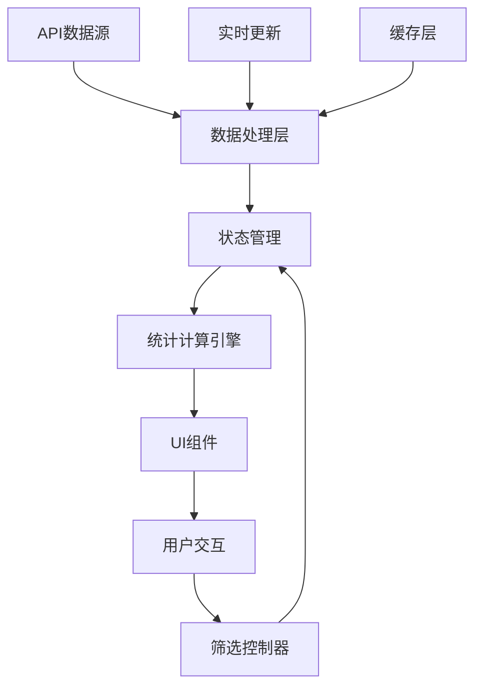
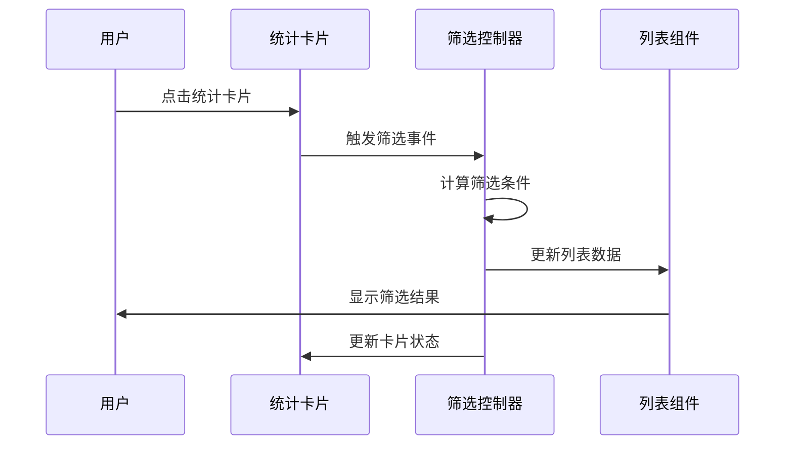

# 审批搜索页面数据增强设计文档

## 概述

本设计文档详细描述了如何将审批搜索页面从静态数据展示改进为基于真实数据的动态系统，包括数据架构、组件设计、交互逻辑和视觉优化方案。

## 架构设计

### 数据流架构



### 核心数据结构

```javascript
// 统计数据结构
interface StatisticsData {
  total: number;           // 总记录数
  pending: number;         // 待审批数量
  approved: number;        // 已通过数量
  rejected: number;        // 已拒绝数量
  entered: number;         // 已进场车辆数
  exited: number;          // 已离场车辆数
  todayPending: number;    // 今日待审数
  approvalRate: number;    // 通过率百分比
  trends: TrendData[];     // 趋势数据
}

// 趋势数据结构
interface TrendData {
  date: string;
  hour?: number;
  approved: number;
  rejected: number;
  pending: number;
  total: number;
}

// 筛选状态
interface FilterState {
  timeRange: string | null;
  status: string[];
  vehicleStatus: string[];
  isActive: boolean;
  activeFilters: string[];
}
```

## 组件设计

### 1. 数据统计卡片组件 (StatisticsCards)

#### 功能特性
- 显示实时统计数据
- 支持点击筛选
- 视觉状态反馈
- 数据变化动画

#### 组件结构
```vue
<template>
  <div class="statistics-cards">
    <StatCard 
      v-for="stat in statistics" 
      :key="stat.key"
      :data="stat"
      :active="isFilterActive(stat.key)"
      @click="handleCardClick(stat.key)"
    />
  </div>
</template>
```

#### 卡片类型设计
1. **今日待审卡片**
   - 数据源: 今日创建的待审批记录
   - 点击行为: 筛选今日待审批记录
   - 视觉: 橙色主题，紧急感设计

2. **通过率卡片**
   - 数据源: (已通过数量 / 已处理总数) * 100
   - 点击行为: 筛选已通过记录
   - 视觉: 绿色主题，成功感设计

3. **车辆在场卡片**
   - 数据源: vehicleStatus为"已进场"的记录
   - 点击行为: 筛选在场车辆记录
   - 视觉: 蓝色主题，信息感设计

### 2. 增强筛选系统 (EnhancedFilterSystem)

#### 筛选逻辑设计
```javascript
class FilterController {
  // 统计卡片筛选
  handleCardFilter(cardType) {
    switch(cardType) {
      case 'todayPending':
        return this.filterTodayPending();
      case 'approvalRate':
        return this.filterApproved();
      case 'vehicleEntered':
        return this.filterVehicleEntered();
    }
  }
  
  // 组合筛选逻辑
  combineFilters(filters) {
    return this.originalList.filter(item => {
      return filters.every(filter => filter(item));
    });
  }
}
```

#### 筛选状态管理
- 使用Vuex管理筛选状态
- 支持多条件组合筛选
- 提供筛选历史记录
- 支持快速清除筛选

### 3. 审批趋势图优化 (OptimizedTrendChart)

#### 布局改进
- 扩展图表高度至300rpx
- 增加数据点密度
- 添加交互式数据标签
- 支持时间范围选择

#### 数据展示增强
```javascript
// 趋势数据计算
getTrendData(timeRange = 7) {
  const days = this.getLast7Days();
  return days.map(day => ({
    date: day,
    approved: this.getApprovedCountByDate(day),
    rejected: this.getRejectedCountByDate(day),
    pending: this.getPendingCountByDate(day),
    efficiency: this.calculateEfficiency(day)
  }));
}
```

#### 交互功能
- 悬停显示详细数据
- 点击数据点筛选对应日期
- 支持缩放和平移
- 数据异常高亮提示

### 4. 审批处理量图表 (ProcessingVolumeChart)

#### 功能重新定义
将原"车辆流量图"改为"审批处理量图表"，显示：
- 每小时审批处理数量
- 处理高峰时段标识
- 处理效率趋势
- 工作负载分布

#### 数据结构
```javascript
interface ProcessingData {
  hour: number;           // 小时 (0-23)
  processed: number;      // 已处理数量
  approved: number;       // 通过数量
  rejected: number;       // 拒绝数量
  avgTime: number;        // 平均处理时间(分钟)
  efficiency: number;     // 处理效率百分比
}
```

#### 视觉设计
- 柱状图显示处理量
- 颜色区分通过/拒绝
- 高峰时段特殊标识
- 效率曲线叠加显示

### 5. 数据工作台布局优化 (OptimizedWorkspace)

#### 响应式网格系统
```scss
.workspace-grid {
  display: grid;
  grid-template-columns: repeat(auto-fit, minmax(300px, 1fr));
  gap: 20rpx;
  
  @media (max-width: 768px) {
    grid-template-columns: 1fr;
  }
}
```

#### 组件排列优先级
1. **第一行**: 核心统计卡片 (3列)
2. **第二行**: 审批趋势图 (2/3宽度) + 状态分布饼图 (1/3宽度)
3. **第三行**: 处理量图表 (全宽)
4. **第四行**: 时间线和热力图 (可折叠)

## 数据处理逻辑

### 实时统计计算

```javascript
class StatisticsCalculator {
  constructor(originalList, pendingList) {
    this.originalList = originalList;
    this.pendingList = pendingList;
  }
  
  // 计算今日待审数量
  getTodayPendingCount() {
    const today = new Date().toDateString();
    return this.originalList.filter(item => 
      item.status === '待审批' && 
      new Date(item.appointmentTime).toDateString() === today
    ).length;
  }
  
  // 计算通过率
  getApprovalRate() {
    const processed = this.originalList.filter(item => 
      item.status !== '待审批'
    );
    if (processed.length === 0) return 0;
    
    const approved = processed.filter(item => 
      item.status === '已通过'
    );
    return Math.round((approved.length / processed.length) * 100);
  }
  
  // 计算车辆在场数量
  getVehicleEnteredCount() {
    return this.originalList.filter(item => 
      item.vehicleStatus === '已进场'
    ).length;
  }
}
```

### 筛选算法优化

```javascript
class FilterEngine {
  // 高性能筛选实现
  applyFilters(data, filters) {
    // 使用索引优化
    const indexedData = this.createIndexes(data);
    
    // 并行筛选
    const results = filters.map(filter => 
      this.applyFilter(indexedData, filter)
    );
    
    // 交集计算
    return this.intersect(results);
  }
  
  // 创建数据索引
  createIndexes(data) {
    return {
      byStatus: this.groupBy(data, 'status'),
      byDate: this.groupBy(data, 'appointmentTime'),
      byVehicleStatus: this.groupBy(data, 'vehicleStatus')
    };
  }
}
```

## 交互设计

### 筛选交互流程



### 状态反馈设计

1. **点击反馈**
   - 卡片按下效果 (scale: 0.95)
   - 颜色变化过渡 (0.3s ease)
   - 涟漪效果扩散

2. **筛选状态**
   - 激活卡片边框高亮
   - 筛选标签显示
   - 列表项数量更新

3. **加载状态**
   - 骨架屏占位
   - 进度指示器
   - 数据更新动画

### 手势支持

```javascript
// 移动端手势处理
class GestureHandler {
  // 卡片滑动筛选
  handleSwipeFilter(direction, cardType) {
    if (direction === 'right') {
      this.applyFilter(cardType);
    } else if (direction === 'left') {
      this.clearFilter(cardType);
    }
  }
  
  // 图表缩放
  handleChartPinch(scale, chart) {
    chart.setZoom(scale);
    chart.updateView();
  }
}
```

## 视觉设计

### 色彩系统

```scss
// 状态色彩定义
$colors: (
  pending: #fa8c16,      // 待审批 - 橙色
  approved: #52c41a,     // 已通过 - 绿色  
  rejected: #f5222d,     // 已拒绝 - 红色
  entered: #1890ff,      // 已进场 - 蓝色
  exited: #722ed1,       // 已离场 - 紫色
  neutral: #8c8c8c       // 中性 - 灰色
);

// 渐变定义
@mixin card-gradient($color) {
  background: linear-gradient(135deg, 
    lighten($color, 20%) 0%, 
    $color 100%
  );
}
```

### 动画系统

```scss
// 统计数字变化动画
@keyframes countUp {
  from { 
    transform: translateY(20px); 
    opacity: 0; 
  }
  to { 
    transform: translateY(0); 
    opacity: 1; 
  }
}

// 卡片激活动画
@keyframes cardActivate {
  0% { transform: scale(1); }
  50% { transform: scale(1.05); }
  100% { transform: scale(1.02); }
}

// 图表数据更新动画
@keyframes chartUpdate {
  from { 
    transform: scaleY(0); 
    transform-origin: bottom; 
  }
  to { 
    transform: scaleY(1); 
  }
}
```

### 响应式设计

```scss
// 断点定义
$breakpoints: (
  mobile: 480px,
  tablet: 768px,
  desktop: 1024px,
  large: 1200px
);

// 工作台响应式布局
.workspace-container {
  @include mobile {
    .statistics-cards {
      grid-template-columns: 1fr;
      gap: 12rpx;
    }
    
    .chart-container {
      height: 200rpx;
    }
  }
  
  @include tablet {
    .statistics-cards {
      grid-template-columns: repeat(2, 1fr);
    }
  }
  
  @include desktop {
    .statistics-cards {
      grid-template-columns: repeat(3, 1fr);
    }
  }
}
```

## 性能优化

### 数据计算优化

```javascript
// 使用Web Worker进行大数据量计算
class DataProcessor {
  constructor() {
    this.worker = new Worker('/workers/statistics.js');
  }
  
  async calculateStatistics(data) {
    return new Promise((resolve) => {
      this.worker.postMessage({ type: 'CALCULATE', data });
      this.worker.onmessage = (e) => {
        resolve(e.data.result);
      };
    });
  }
}

// 数据缓存策略
class DataCache {
  constructor() {
    this.cache = new Map();
    this.ttl = 5 * 60 * 1000; // 5分钟缓存
  }
  
  get(key) {
    const item = this.cache.get(key);
    if (item && Date.now() - item.timestamp < this.ttl) {
      return item.data;
    }
    return null;
  }
  
  set(key, data) {
    this.cache.set(key, {
      data,
      timestamp: Date.now()
    });
  }
}
```

### 渲染优化

```javascript
// 虚拟滚动优化大列表
import { VirtualList } from '@tanstack/vue-virtual';

// 图表懒加载
const ChartComponent = defineAsyncComponent({
  loader: () => import('./Chart.vue'),
  loadingComponent: ChartSkeleton,
  delay: 200
});
```

## 错误处理

### 数据异常处理

```javascript
class ErrorHandler {
  // 数据验证
  validateData(data) {
    if (!Array.isArray(data)) {
      throw new Error('数据格式错误');
    }
    
    return data.filter(item => 
      item && typeof item === 'object' && item.id
    );
  }
  
  // 计算异常处理
  safeCalculate(fn, fallback = 0) {
    try {
      const result = fn();
      return isNaN(result) ? fallback : result;
    } catch (error) {
      console.warn('计算异常:', error);
      return fallback;
    }
  }
}
```

### 用户体验降级

```javascript
// 网络异常时的降级策略
class FallbackStrategy {
  // 使用缓存数据
  useCachedData() {
    const cached = localStorage.getItem('statistics_cache');
    return cached ? JSON.parse(cached) : this.getDefaultData();
  }
  
  // 显示离线提示
  showOfflineNotice() {
    this.$toast.warning('网络连接异常，显示缓存数据');
  }
}
```

## 测试策略

### 单元测试

```javascript
// 统计计算测试
describe('StatisticsCalculator', () => {
  test('应该正确计算今日待审数量', () => {
    const calculator = new StatisticsCalculator(mockData);
    expect(calculator.getTodayPendingCount()).toBe(5);
  });
  
  test('应该正确计算通过率', () => {
    const calculator = new StatisticsCalculator(mockData);
    expect(calculator.getApprovalRate()).toBe(75);
  });
});
```

### 集成测试

```javascript
// 筛选功能测试
describe('FilterSystem', () => {
  test('点击统计卡片应该正确筛选数据', async () => {
    const wrapper = mount(ApproveSearch);
    await wrapper.find('.today-pending-card').trigger('click');
    
    expect(wrapper.vm.pendingList).toHaveLength(5);
    expect(wrapper.vm.isFiltering).toBe(true);
  });
});
```

## 部署考虑

### 兼容性
- Vue 3.2+ 支持
- 移动端浏览器兼容
- 低端设备性能优化

### 监控指标
- 页面加载时间
- 筛选响应时间
- 图表渲染性能
- 用户交互成功率

## 总结

本设计方案通过以下关键改进来解决现有问题：

1. **数据真实性**: 建立完整的统计计算引擎，确保所有数据基于真实业务数据
2. **交互增强**: 实现点击筛选功能，提供直观的数据探索体验
3. **布局优化**: 重新设计工作台布局，充分利用空间展示有价值信息
4. **功能重定义**: 将车辆流量图改为审批处理量图表，提供实际业务价值
5. **性能保障**: 通过缓存、虚拟化等技术确保良好的用户体验

该设计方案在保持现有代码结构的基础上，通过渐进式改进来实现功能增强，确保开发风险可控且用户体验显著提升。