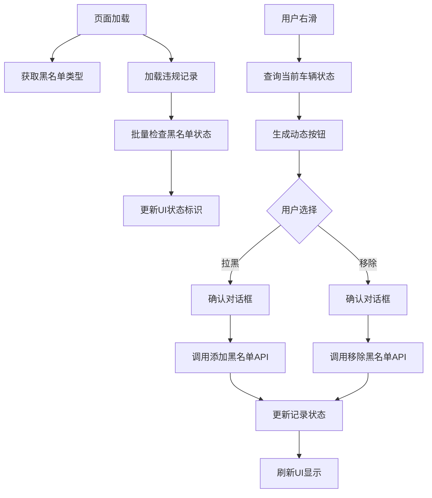

# Violation页面右滑黑名单功能修改说明

## 功能概述
将violation.vue页面的右滑操作从"通过/拒绝"改为"拉黑/移除"黑名单功能，集成后端黑名单接口。

## 主要修改内容

### 1. 数据结构修改
```javascript
// 添加黑名单相关数据
blacklistData: {
    specialCarTypes: [],        // 黑名单类型列表
    currentCarBlackStatus: null, // 当前车辆的黑名单状态
    loading: false
}
```

### 2. 右滑按钮配置修改
- **原来**: "通过"(绿色) + "拒绝"(红色)
- **现在**: "拉黑"(红色) + "移除"(绿色/灰色)

**动态按钮逻辑**:
- 如果车辆已在黑名单：只显示"移除"按钮
- 如果车辆不在黑名单：显示"拉黑" + "移除"(灰色禁用)

### 3. 集成的后端接口

| 接口名称 | 路径 | 用途 |
|---------|------|------|
| `getSpecialCarTypeList` | `/parking/blackList/getSpecialCarTypeList` | 获取黑名单类型列表 |
| `getParkBlack` | `/parking/blackList/getParkBlack` | 查询单个车辆黑名单状态 |
| `getParkBlackList` | `/parking/blackList/getParkBlackList` | 批量获取黑名单车辆 |
| `addBlackListCar` | `/parking/blackList/addBlackListCar` | 添加车辆到黑名单 |
| `removeBlackListCar` | `/parking/blackList/removeBlackListCar` | 从黑名单移除车辆 |

### 4. 新增核心方法

#### 🔍 黑名单状态查询
- `checkCarBlacklistStatus(plateNumber)` - 查询单个车辆黑名单状态
- `batchCheckBlacklistStatus()` - 批量检查所有车辆的黑名单状态

#### 🚫 黑名单操作
- `addToBlacklist(record, index)` - 添加到黑名单
- `removeFromBlacklist(record, index)` - 从黑名单移除
- `performAddToBlacklist(record, index)` - 执行添加操作
- `performRemoveFromBlacklist(record, index)` - 执行移除操作

#### 🔧 辅助方法
- `generateSwipeOptions(record)` - 根据车辆状态动态生成滑动选项
- `isCarInBlacklist(plateNumber)` - 检查车辆是否在黑名单中
- `getSpecialCarTypes()` - 获取黑名单类型列表

### 5. UI/UX 改进

#### 视觉提示
- **黑名单标签**: 在车牌旁显示 "🚫 已拉黑" 红色标签
- **脉冲动画**: 黑名单标签有醒目的脉冲效果
- **按钮状态**: 移除按钮在车辆不在黑名单时显示为灰色

#### 交互优化
- **智能提示**: 根据车辆当前状态提供相应操作提示
- **状态反馈**: 操作成功后立即更新UI状态
- **错误处理**: 完善的错误提示和异常处理

### 6. 数据流程



### 7. 样式修改

```scss
// 黑名单状态标签
.blacklist-status-tag {
    padding: 8rpx 16rpx;
    border-radius: 16rpx;
    font-size: 24rpx;
    margin-left: 8rpx;
    
    &.status-blacklisted {
        background: #ff1744;
        box-shadow: 0 2rpx 8rpx rgba(255, 23, 68, 0.3);
        animation: pulse 2s infinite;
    }
}

// 脉冲动画
@keyframes pulse {
    0% { opacity: 1; }
    50% { opacity: 0.7; }
    100% { opacity: 1; }
}
```

## 配置说明

### 停车场代码配置
在 `getDefaultParkCode()` 方法中修改默认停车场代码：
```javascript
getDefaultParkCode() {
    return 'ZK001'; // 根据实际情况修改
}
```

### 黑名单类型配置
系统会自动获取后端配置的黑名单类型，添加黑名单时使用第一个类型作为默认类型。

## 测试建议

1. **基础功能测试**
   - 右滑显示正确按钮
   - 拉黑操作成功并显示状态
   - 移除操作成功并更新状态

2. **边界情况测试**
   - 网络异常处理
   - 重复拉黑车辆
   - 移除不在黑名单的车辆

3. **性能测试**
   - 大量数据下的加载性能
   - 批量黑名单状态查询效率

## 注意事项

1. **后端依赖**: 确保后端BlackListController的所有接口正常工作
2. **权限控制**: 考虑在后端添加操作权限验证
3. **数据同步**: 黑名单状态的实时性依赖接口响应速度
4. **错误恢复**: 操作失败时的状态回滚机制

## 未来优化建议

1. **缓存机制**: 添加黑名单状态的本地缓存
2. **实时同步**: 使用WebSocket实现黑名单状态的实时更新
3. **批量操作**: 支持批量拉黑/移除功能
4. **操作历史**: 记录黑名单操作的历史日志 